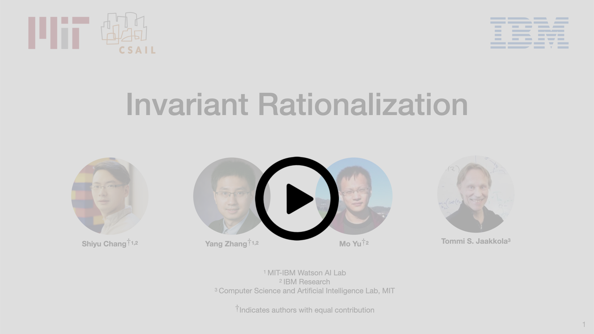

# Invariant Rationalization
This repo contains the Tensorflow implementation of [Invariant Rationalization](https://arxiv.org/abs/2003.09772).  To make this repo neat and light-weight, we only release our core code on the polluted [IMDB dataset](http://ai.stanford.edu/~amaas/data/sentiment/) (please refer to the paper for details) for the demo purpose.  If you are interested in experimenting with the exact data splits of our beer review datasets, please contact us, and we are very happy to provide the data and help.

There is a short video that explains the main concepts of our work. If you find this work useful and use it in your research, please consider citing our paper.

[](https://youtu.be/C9dUcljt4WQ)


```
@article{chang2020invariant,
  title={Invariant Rationalization},
  author={Chang, Shiyu and Zhang, Yang and Yu, Mo and Jaakkola, Tommi S},
  journal={arXiv preprint arXiv:2003.09772},
  year={2020}
}
```

## Getting Started
Below is the step-by-step instruction on running our code.  After cloning the repo, please first run the following script to download the dataset and the pre-trained word embeddings.
```bash
sh download_data.sh
```
The IMDB dataset downloaded here is identical to the one in `tensorflow datasets`.  You could of course directly using the [build-in functions](https://www.tensorflow.org/datasets/catalog/imdb_reviews) in TensorFlow with some minor tweaks.  

Next, you need to properly set up your virtual environment and install all dependencies from the `requirements.txt`.  You may consider the following commend:
```bash
pip install -r requirements.txt
```

Once all packages are installed, now you are ready to have some fun by using the following commends under your main directory.
```bash
sh run_demo.sh
```

You are expected to see a similar result as the following.
```console
The best dev performance appears at epoch: 28.
The best dev performance and bias selection are: 0.8454, and 0.0000.
The corresponding test performance and bias selection are: 0.8492, and 0.0000.
```
**Tested environment:**
Python 3.6.10, Tensorflow: 1.14, CUDA driver: 410.48, CUDA version: 10.0, and Cudnn: 7.4.1.

## Final Words
That's all for now and hope this repo is useful to your research.  For any questions, please create an issue and we will get back to you as soon as possible.
